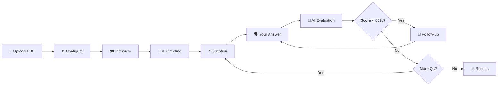

<div align="center">

# 🎓 Viva — AI Interview Coach

### _Your Personal AI-Powered Socratic Interview Companion_

[](https://react.dev)
[](https://typescriptlang.org)
[](https://vitejs.dev)
[](https://firebase.google.com)
[](https://groq.com)
[](https://elevenlabs.io)
[](LICENSE)

<br />

**Upload your notes. Get grilled by an AI interviewer. Level up.**

Viva transforms your study documents into dynamic, conversational mock interviews with AI-powered feedback, voice I/O, and adaptive difficulty — all wrapped in a striking neobrutalist UI.

<br />

[Get Started](#-quick-start) · [Features](#-features) · [Architecture](#-architecture) · [Contributing](#-contributing)

</div>

---

## ✨ Features

<table>
<tr>
<td width="50%">

### 🧠 Conversational AI Engine
- **Persona-based interviewing** — Socratic, Examiner, or Friendly styles
- **Dynamic follow-up questions** — AI digs deeper on weak answers
- **Contextual transitions** — smooth, natural flow between questions
- **Adaptive difficulty** — adjusts based on your performance

</td>
<td width="50%">

### 🎤 Voice I/O
- **ElevenLabs TTS** — human-quality AI voice reads questions aloud
- **Groq Whisper STT** — powered by `whisper-large-v3-turbo` for fast, accurate transcription
- **Graceful fallbacks** — degrades to browser Web Speech API if keys are missing
- **Live waveform indicators** — visual feedback during speaking & listening

</td>
</tr>
<tr>
<td width="50%">

### 📊 Rich Feedback
- **Per-question scoring** (0–100%) with color-coded badges
- **Strengths & gaps analysis** — know exactly what to improve
- **Conversational feedback** — AI explains scores naturally
- **Session summary** — overall performance breakdown at completion

</td>
<td width="50%">

### 🎨 Neobrutalist Design
- **Bold aesthetics** — thick borders, hard shadows, acid-green accents
- **Vibrant gradients** — violet, pink, blue, teal color system
- **Animated AI Orb** — gradient-filled with state-driven animations
- **Dark mode** — full dark theme support
- **Responsive** — works on desktop and tablet

</td>
</tr>
</table>

### More Highlights

| Feature | Description |
|---------|-------------|
| 📄 **PDF Upload** | Upload study notes, textbooks, or any PDF document |
| 🔐 **Auth** | Firebase Authentication with email/password and social login |
| 💾 **Session Persistence** | All sessions saved to Firestore with full review history |
| ⏱ **Smart Timer** | Pauses during AI evaluation — only counts your thinking time |
| 🔄 **Session Reset** | Restart with fresh questions at any time |
| ⌨️ **Keyboard Shortcuts** | `⌘+Enter` to submit, smooth workflow |

---

## 🏗 Architecture

```
┌─────────────────────────────────────────────────────────┐
│                      Frontend (React)                    │
│  ┌──────────┐  ┌──────────┐  ┌──────────┐  ┌─────────┐ │
│  │  Pages   │  │  Hooks   │  │Components│  │ Context │ │
│  │ Session  │  │useInterview│ │ AIOrb    │  │AuthCtx  │ │
│  │Dashboard │  │useSpeech │  │FeedbackCd│  │ThemeCtx │ │
│  │Configure │  │useDocuments│ │AppLayout │  │         │ │
│  └────┬─────┘  └────┬─────┘  └──────────┘  └─────────┘ │
│       │              │                                   │
│  ┌────┴──────────────┴──────────────────────────────┐   │
│  │              lib/ (Service Layer)                 │   │
│  │  interview-engine.ts  │  documents.ts  │ sessions │   │
│  └──────────────────────────────────────────────────┘   │
└──────────────┬────────────────────┬──────────────────────┘
               │                    │
       ┌───────┴───────┐    ┌──────┴──────┐
       │   Groq API    │    │  Firebase   │
       │ • LLM (llama) │    │ • Auth      │
       │ • Whisper STT │    │ • Firestore │
       └───────────────┘    │ • Storage   │
                            └─────────────┘
       ┌───────────────┐
       │  ElevenLabs   │
       │ • TTS (Rachel)│
       └───────────────┘
```

---

## 🚀 Quick Start

### Prerequisites

| Tool | Version |
|------|---------|
| **Node.js** | ≥ 18 |
| **npm** | ≥ 9 |

### 1. Clone & Install

```bash
git clone https://github.com/Ankush-Jha/ai-interview.git
cd ai-interview
npm install
```

### 2. Configure Environment

Create a `.env.local` file in the project root:

```env
# Firebase
VITE_FIREBASE_API_KEY=your_firebase_api_key
VITE_FIREBASE_AUTH_DOMAIN=your_project.firebaseapp.com
VITE_FIREBASE_PROJECT_ID=your_project_id
VITE_FIREBASE_STORAGE_BUCKET=your_project.firebasestorage.app
VITE_FIREBASE_MESSAGING_SENDER_ID=your_sender_id
VITE_FIREBASE_APP_ID=your_app_id

# Groq API (required — powers LLM + Whisper STT)
VITE_GROQ_API_KEY=your_groq_api_key

# ElevenLabs TTS (optional — falls back to browser TTS)
VITE_ELEVENLABS_API_KEY=your_elevenlabs_api_key
```

> **Where to get keys:**
> - 🔑 [Groq Console](https://console.groq.com) — free tier available
> - 🔑 [ElevenLabs](https://elevenlabs.io) → Profile → API Keys — free tier (10k chars/month)
> - 🔑 [Firebase Console](https://console.firebase.google.com) — create a new project

### 3. Run

```bash
npm run dev
```

Open [http://localhost:5173](http://localhost:5173) and start interviewing! 🎉

---

## 📁 Project Structure

```
src/
├── components/          # Reusable UI components
│   ├── layout/          # AppLayout, Header, Sidebar
│   └── ui/              # shadcn/ui primitives
├── contexts/            # React contexts (Auth)
├── hooks/               # Custom hooks
│   ├── useInterview.ts  # Interview state machine
│   ├── useSpeech.ts     # ElevenLabs TTS + Groq Whisper STT
│   └── useDocuments.ts  # PDF document management
├── lib/                 # Service layer
│   ├── interview-engine.ts  # Groq LLM integration
│   ├── documents.ts     # Firestore document CRUD
│   ├── sessions.ts      # Session persistence
│   └── firebase.ts      # Firebase config
├── pages/               # Route pages
│   ├── Session.tsx       # Main interview experience
│   ├── Dashboard.tsx     # Home with document cards
│   ├── Configure.tsx     # Interview settings
│   └── ...
├── types/               # TypeScript interfaces
│   └── interview.ts     # Core interview types
└── index.css            # Neobrutalist design system
```

---

## 🎯 How It Works



1. **Upload** your study material (PDF)
2. **Configure** persona, difficulty, and question count
3. **Interview** — AI greets you, then asks adaptive questions
4. **Answer** via text or voice (Groq Whisper transcription)
5. **Get feedback** — AI evaluates with scores, strengths, and gaps
6. **Follow-ups** — AI probes deeper on weak answers
7. **Review** — detailed session summary with per-question breakdown

---

## 🛠 Tech Stack

<div align="center">

| Layer | Technology | Purpose |
|-------|-----------|---------|
| **Frontend** | React 19 + TypeScript | UI framework |
| **Build** | Vite 7 | Lightning-fast dev server |
| **Styling** | Tailwind CSS 4 + Custom CSS | Neobrutalist design system |
| **UI Kit** | shadcn/ui + Radix | Accessible component primitives |
| **Auth & DB** | Firebase (Auth + Firestore) | User management & data persistence |
| **LLM** | Groq API (Llama 3) | Question generation & evaluation |
| **TTS** | ElevenLabs (v2 Multilingual) | Human-quality AI voice |
| **STT** | Groq Whisper (large-v3-turbo) | Fast speech-to-text |
| **Routing** | React Router 7 | Client-side navigation |
| **Icons** | Lucide React | Consistent icon set |

</div>

---

## 🎨 Design System

Viva uses a **neobrutalist** design language with vibrant accent colors:

| Token | Color | Usage |
|-------|-------|-------|
| `--neo-primary` | `#b9f20d` 🟢 | Primary actions, highlights |
| `--neo-violet` | `#7c3aed` 🟣 | TTS indicators, AI speaking |
| `--neo-pink` | `#ec4899` 🩷 | Gradients, accents |
| `--neo-blue` | `#3b82f6` 🔵 | STT indicators, listening |
| `--neo-gold` | `#f59e0b` 🟡 | AI thinking, medium scores |
| `--neo-error` | `#FF003C` 🔴 | Errors, low scores |

**Key design elements:** Thick 3px borders · Hard box shadows · Rounded AI orb with gradient fills · Waveform animations · `Space Grotesk` + `Archivo Black` + `Space Mono` typography

---

## 🤝 Contributing

Contributions are welcome! Here's how to get started:

1. **Fork** the repository
2. **Create** a feature branch (`git checkout -b feat/amazing-feature`)
3. **Commit** your changes (`git commit -m 'feat: add amazing feature'`)
4. **Push** to the branch (`git push origin feat/amazing-feature`)
5. **Open** a Pull Request

### Development Commands

```bash
npm run dev       # Start development server
npm run build     # Production build
npm run preview   # Preview production build
npx tsc --noEmit  # Type check
```

---

## 📄 License

This project is licensed under the **ISC License** — see the [LICENSE](LICENSE) file for details.

---

<div align="center">

**Built with ❤️ by [Ankush Jha](https://github.com/Ankush-Jha)**

⭐ Star this repo if you found it useful!

</div>
